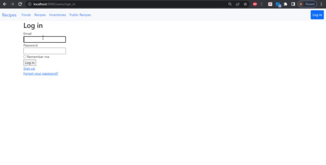

# Recipe app

> The Recipe app keeps track of all the users' recipes, ingredients, and inventory. It allows users to save ingredients, keep track of what they have, create recipes, and generate a shopping list based on what they have and what is missing from a recipe. Also, since sharing recipes is an important part of cooking the app allows users to make them public so anyone can access them.


### Quick Preview




# How to build the Recipe app
The end result should follow the following data model (this is an Entity Relationship Diagram that you are already familiar with):

> 
## Built With

- Ruby on Rails
- Bootstrap
- Ruby
- Rubocop
- Gems
  - Rspec
  - Shoulder-matcher
  - Capybara
  - FactoryBot
  - Selenium-webdriver
  - Faker
  - cancancan
  - Devise
  - 


## Getting Started

**To get a local copy up and running follow these simple example steps.**

### Prerequisites
- Ruby should be installed on your machine
- Install Ruby on Rails and PostgresQL

### Setup
```
git clone https://github.com/NataliaPoletaeva/recipes.git
cd recipes
```
### Install
```
bundle install
```

### Play with the code
```
rails c
```

### Populate the db with dummy data
```
rails db:migrate
rails db:seed
```

### Run linters
```
rubocop -A
```

### Start the application
```
rails s
```

### Tests
```
rspec spec (run all tests)
rspec spec/name_of_folder/name_of_file.rb (run specific tests)
```
### Authors

👤 Natalia Poletaeva

- GitHub: [@NataliaPoletaeva](https://github.com/NataliaPoletaeva)
- Twitter: [@Fly_Meets](https://twitter.com/Fly_Meets)
- LinkedIn: [Natalia Poletaeva](https://www.linkedin.com/in/nataliapoletaeva/)
- AngelList: [Natalia Poletaeva](https://angel.co/u/natalia-poletaeva-1)

👤 **Bertrand Mutangana Ishimwe**

- GitHub: [@BertrandConxy](https://github.com/BertrandConxy)
- Twitter: [@Bconxy](https://twitter.com/BertrandMutanga)
- LinkedIn: [Bertrand Mutangana Ishimwe](https://www.linkedin.com/in/bertrandmutangana)

👤 **Butler Shimaluwani**

- GitHub: [@Butlermuwo](https://github.com/butlermuwo)
- Twitter: [@Butlermuwo](https://twitter.com/ButlerMuwo)
- LinkedIn: [@Butlermuwo](https://www.linkedin.com/in/butlermuwo)

## 🤝 Contributing

Contributions, issues, and feature requests are welcome!

Feel free to check the [issues page](../../issues/).

## Show your support

Give a ⭐️ if you like this project!

## Acknowledgments

- Many thanks to Microverse
- Thanks to everyone who contributed
- Thanks to everyone whose ideas were used to achieve this project
